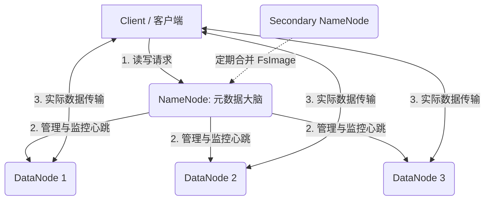
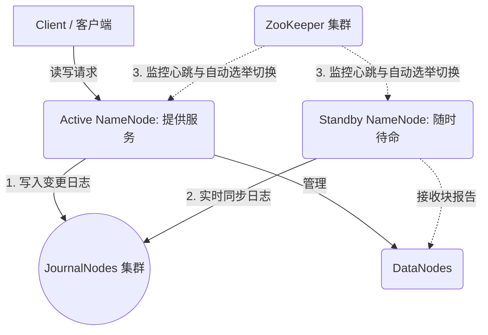
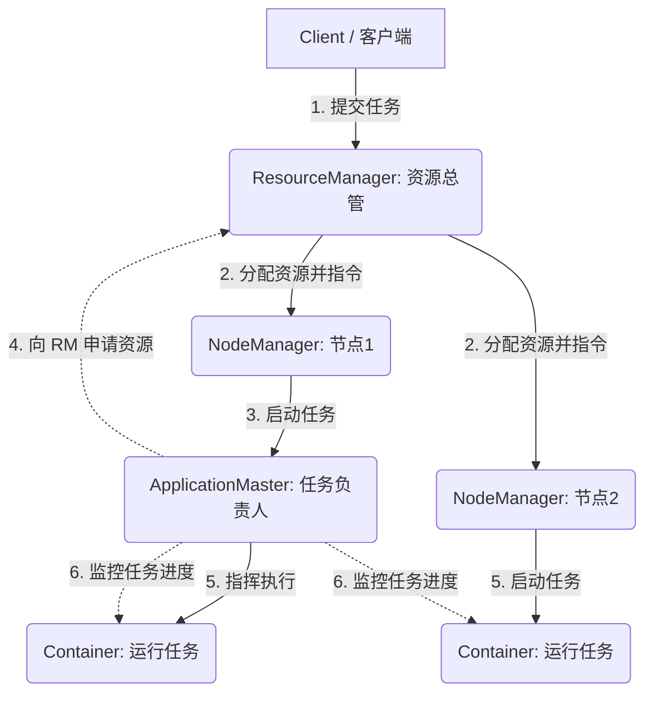

# Hadoop 生态基础知识总结

## 一、 大数据与 Hadoop 简介
大数据通常具备 4V 特征：Volume（数据量大）、Velocity（处理速度快）、Variety（数据类型繁多）、Value（价值密度低）。
Hadoop 是 Apache 基金会旗下的一个开源分布式计算平台，主要为了解决两个核心问题：
1. **海量数据的存储**（HDFS）
2. **海量数据的计算**（MapReduce / YARN）

---

## 二、 核心组件 1：HDFS (分布式文件系统)
HDFS (Hadoop Distributed File System) 采用 Master/Slave（主从）架构。

### 1. 核心设计思想
- **分块存储 (Block)**：大文件会被切割成多个 Block（Hadoop 3.x 默认 128MB），分散存储在多台服务器上。
- **多副本机制**：为了防止数据丢失，每个 Block 默认有 3 个副本，存放在不同的机器上。

### 2. 核心角色 (守护进程)
- **NameNode (NN - 大脑/主节点)**
  - 存储文件的元数据（文件名、目录结构、文件属性等）。
  - 记录每个文件块所在的 DataNode 节点信息。
  - **注意**：NN 的元数据存在内存中，如果单节点的 NN 挂掉，整个集群将无法访问。
- **DataNode (DN - 躯干/工作节点)**
  - 真正存储文件 Block 数据。
  - 定期向 NN 发送心跳和自己的块报告，证明自己“还活着”。
- **Secondary NameNode (2NN -秘书)**
  - 并不是 NN 的热备，而是用来辅助 NN 合并元数据日志（FsImage 和 Edits），减轻 NN 启动时的压力。

### 3. 高可用架构 (HA - High Availability) 与 JournalNode
在企业生产环境中，单台 NameNode 存在**单点故障风险**（如果 NN 宕机，整个集群将瘫痪）。为了解决这个问题，Hadoop 引入了 HA（高可用）机制。这也就是你提到的 **JournalNode** 大显身手的地方。

**HA 架构下的核心变化：**
- **取消 SecondaryNameNode**：HA 架构下不再需要 2NN，元数据合并工作直接由 Standby NameNode 完成。
- **双 NameNode 机制**：集群中会有两台 NameNode，一台是 **Active**（活跃状态，对外提供服务），另一台是 **Standby**（待命热备状态，时刻同步数据）。
- **JournalNode (JN - 日志节点)**：
  - **核心作用**：它是连接 Active NN 和 Standby NN 的数据共享桥梁。
  - **原理机制**：Active NN 会把每一次的元数据变更日志（Edits）写入到一组 JournalNode 集群中；Standby NN 则时刻盯着 JournalNode，一旦有新日志，立刻读取并在自己内存中重放。这样就保证了 Active 和 Standby 的数据时刻保持一致。
  - **部署特性**：JournalNode 通常部署为奇数个（如 3、5 个），只要有一半以上的节点存活，日志系统就能正常工作。
- **ZooKeeper (ZK) 与 ZKFC**：ZooKeeper 负责监控这两台 NN。如果 Active NN 突然宕机，ZooKeeper 会迅速反应，自动将 Standby NN 提升为新的 Active NN，实现无缝切换（自动故障转移）。

---

## 三、 核心组件 2：YARN (分布式资源调度框架)
YARN (Yet Another Resource Negotiator) 就像是整个集群的“操作系统”，负责统一管理所有的 CPU 和内存资源。

### 1. 核心角色
- **ResourceManager (RM - 资源总管/主节点)**
  - 掌握整个集群的计算资源。
  - 接收用户的计算任务，分配最初的资源。
- **NodeManager (NM - 单机管家/工作节点)**
  - 运行在每个 DataNode 机器上，管理这台机器上的 CPU 和内存。
  - 负责启动和监控容器（Container，资源隔离的基本单位）。
- **ApplicationMaster (AM - 任务负责人)**
  - 每个提交的计算任务都会产生一个专属的 AM。
  - 负责向 RM 申请资源，并在拿到资源后，指挥 NM 启动任务计算逻辑，并监控任务的执行状态。

---

## 四、 核心组件 3：MapReduce (分布式计算框架)
MapReduce 是基于 YARN 运行的数据处理引擎，核心思想是**“分而治之”**。

- **Map 阶段**：将复杂的、庞大的数据拆分成许多小块数据，由多台机器并行处理（映射）。
- **Shuffle 阶段**：连接 Map 和 Reduce 的桥梁，负责数据的分区、排序、分组和网络传输。这是最耗时的一步。
- **Reduce 阶段**：将 Map 阶段输出的中间结果进行汇总、统计，得出最终结论（归约）。

> *说明：由于 MapReduce 每次计算都要频繁读写磁盘，速度较慢。目前在实际企业中，大部分计算任务已被 Spark/Flink 替代，但 MapReduce 依然是理解大数据底层原理的最佳入口。*

---

## 五、 Hadoop 扩展生态图谱
除了核心三大件，Hadoop 还有一个庞大的生态支撑实际业务：

1. **Hive (数据仓库)**：将 SQL 语句转化为 MapReduce/Spark 任务。不会写 Java 也能做大数据分析，离线数仓必备！
2. **Spark / Flink (计算引擎)**：新一代计算引擎。Spark 基于内存计算，适合批处理和机器学习；Flink 适合实时流式数据计算。
3. **HBase (NoSQL 数据库)**：建立在 HDFS 上的列式数据库，支持对 PB 级数据的毫秒级随机读写。
4. **ZooKeeper (分布式协调服务)**：集群的“调度中心”，负责解决分布式系统中的一致性问题（如高可用 HA 选举）。
5. **Flume / Sqoop / Kafka (数据通道)**：
   - Flume：采集服务器实时日志数据。
   - Sqoop：在 Hadoop 和关系型数据库（如 MySQL）之间倒腾数据。
   - Kafka：高性能的消息队列，用于缓冲海量数据，削峰填谷。
