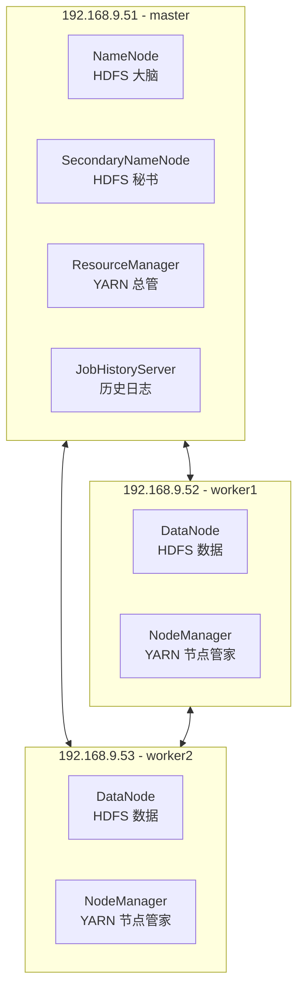

# Hadoop 完全分布式集群部署 SOP (3节点)

## 一、 集群规划建议
你有 9 台机器 (192.168.9.51 - 59)。对于基础学习和中小型项目，建议采用 **3 台服务器** 搭建一套标准的**完全分布式集群**。
这不仅能完全体现出分布式的特性，也能节省资源。

**节点角色分配规划：**
- **master (192.168.9.51)**：主节点，部署 `NameNode` (HDFS 主)、`ResourceManager` (YARN 主)、`SecondaryNameNode`。
- **worker1 (192.168.9.52)**：从节点，部署 `DataNode`、`NodeManager`。
- **worker2 (192.168.9.53)**：从节点，部署 `DataNode`、`NodeManager`。



---

## 二、 部署前置准备 (三台机器都要执行)

> 建议使用 `root` 用户执行以下操作，或者拥有免密 sudo 权限的用户。

### 1. 修改主机名 (Hostname) 并配置 Hosts
在 `192.168.9.51` 执行：`hostnamectl set-hostname master`
在 `192.168.9.52` 执行：`hostnamectl set-hostname worker1`
在 `192.168.9.53` 执行：`hostnamectl set-hostname worker2`

在三台机器的 `/etc/hosts` 文件中都追加以下内容：
```text
192.168.9.51 master
192.168.9.52 worker1
192.168.9.53 worker2
```

### 2. 关闭防火墙和 SELinux
```bash
# 关闭防火墙
systemctl stop firewalld
systemctl disable firewalld

# 关闭 SELinux
setenforce 0
sed -i 's/SELINUX=enforcing/SELINUX=disabled/g' /etc/selinux/config
```

### 3. 配置免密 SSH 登录
让 master 节点能够无密码登录到自己和两台 worker 节点（Hadoop 启停脚本依赖此功能）。
**在 master 节点 (9.51) 上执行：**
```bash
# 生成密钥（一直回车即可）
ssh-keygen -t rsa

# 分发公钥到所有节点（包括自己）
ssh-copy-id master
ssh-copy-id worker1
ssh-copy-id worker2
```
*测试一下：在 master 节点输入 `ssh worker1`，如果不输入密码能登入即为成功，记得 `exit` 退出返回 master。*

### 4. 安装 JDK 8/11
确保三台机器都安装了 JDK。推荐安装到统一下录，比如 `/opt/module/jdk1.8.0`。
记录下 Java 的安装路径（例如 `/usr/lib/jvm/java-1.8.0-openjdk` 或你解压的绝对路径），后续需要配置 `JAVA_HOME`。

---

## 三、 安装与配置 Hadoop (先在 master 节点执行)

### 1. 下载解压
```bash
# 建议建立专门的目录，例如 /opt/module/
mkdir -p /opt/module
cd /opt/module

# 下载 hadoop 3.x
wget https://dlcdn.apache.org/hadoop/common/hadoop-3.3.6/hadoop-3.3.6.tar.gz
tar -zxvf hadoop-3.3.6.tar.gz
cd hadoop-3.3.6
```

### 2. 配置环境变量
在 `~/.bashrc` 或 `/etc/profile` 中添加：
```bash
export HADOOP_HOME=/opt/module/hadoop-3.3.6
export PATH=$PATH:$HADOOP_HOME/bin:$HADOOP_HOME/sbin
```
执行 `source ~/.bashrc` 使其生效。

### 3. 修改核心配置文件 (位于 etc/hadoop/ 目录下)

**① 修改 `hadoop-env.sh`**
找到 `export JAVA_HOME`，将其修改为你的实际 Java 路径：
```bash
export JAVA_HOME=/你的/java/绝对路径
```

**② 修改 `core-site.xml`**
```xml
<configuration>
    <!-- 指定 NameNode 的地址 (指向 master 节点) -->
    <property>
        <name>fs.defaultFS</name>
        <value>hdfs://master:8020</value>
    </property>
    <!-- 指定 Hadoop 临时目录存放位置 -->
    <property>
        <name>hadoop.tmp.dir</name>
        <value>/opt/module/hadoop-3.3.6/data</value>
    </property>
</configuration>
```

**③ 修改 `hdfs-site.xml`**
```xml
<configuration>
    <!-- 副本数量，因为只有2个 worker 节点，副本数设为 2 即可 -->
    <property>
        <name>dfs.replication</name>
        <value>2</value>
    </property>
    <!-- 指定 SecondaryNameNode 的地址 -->
    <property>
        <name>dfs.namenode.secondary.http-address</name>
        <value>master:9868</value>
    </property>
</configuration>
```

**④ 修改 `yarn-site.xml`**
```xml
<configuration>
    <!-- 指定 RM 的地址 -->
    <property>
        <name>yarn.resourcemanager.hostname</name>
        <value>master</value>
    </property>
    <!-- NodeManager 上运行的附属服务，配置成 mapreduce_shuffle -->
    <property>
        <name>yarn.nodemanager.aux-services</name>
        <value>mapreduce_shuffle</value>
    </property>
    <!-- 开启日志聚集功能，方便在页面查看任务日志 -->
    <property>
        <name>yarn.log-aggregation-enable</name>
        <value>true</value>
    </property>
    <property>
        <name>yarn.log.server.url</name>
        <value>http://master:19888/jobhistory/logs</value>
    </property>
</configuration>
```

**⑤ 修改 `mapred-site.xml`**
```xml
<configuration>
    <!-- 指定 MapReduce 程序运行在 Yarn 上 -->
    <property>
        <name>mapreduce.framework.name</name>
        <value>yarn</value>
    </property>
    <!-- 历史服务器端地址 -->
    <property>
        <name>mapreduce.jobhistory.address</name>
        <value>master:10020</value>
    </property>
    <property>
        <name>mapreduce.jobhistory.webapp.address</name>
        <value>master:19888</value>
    </property>
</configuration>
```

**⑥ 修改 `workers` 文件** (Hadoop 2.x 中叫 `slaves`)
里面填写你所有 DataNode 的主机名。删除里面的 `localhost`，添加：
```text
worker1
worker2
```

---

## 四、 分发 Hadoop 目录到其他节点
在 master 节点执行，把配置好的 Hadoop 目录和环境变量文件拷贝给 worker：
```bash
scp -r /opt/module/hadoop-3.3.6 root@worker1:/opt/module/
scp -r /opt/module/hadoop-3.3.6 root@worker2:/opt/module/
```
*(提示：别忘了在 worker1 和 worker2 上也配置一下环境变量)*

---

## 五、 初始化与启动集群

### 1. 格式化 NameNode (仅第一次需要！)
在 **master 节点** 执行：
```bash
hdfs namenode -format
```
*如果输出中没有 ERROR 且看到 `successfully formatted` 则说明成功。*

### 2. 启动 HDFS 和 YARN
在 **master 节点** 执行：
```bash
# 启动 HDFS (会自动去 worker 节点拉起 DataNode)
start-dfs.sh

# 启动 YARN (会自动去 worker 节点拉起 NodeManager)
start-yarn.sh

# 启动历史服务器 (方便看任务日志)
mapred --daemon start historyserver
```

### 3. 验证集群状态
在 **master** 上输入 `jps`，应该看到：
`NameNode`, `ResourceManager`, `SecondaryNameNode`, `JobHistoryServer`。

在 **worker1/worker2** 上输入 `jps`，应该看到：
`DataNode`, `NodeManager`。

### 4. 访问 Web 监控页面 (在你本机的浏览器中)
- **HDFS 控制台**: `http://192.168.9.51:9870`
- **YARN 资源管理页面**: `http://192.168.9.51:8088`

**恭喜，你的完全分布式 Hadoop 集群部署完成了！**
