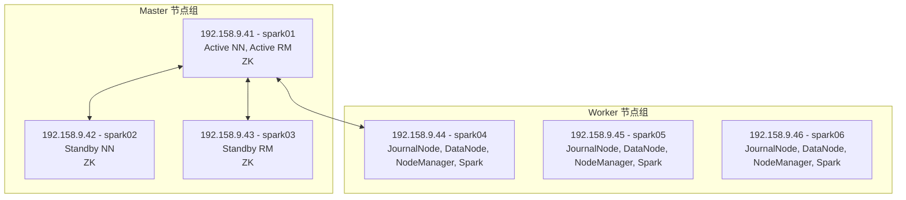

# Hadoop & Spark 高可用 (HA) 集群部署 SOP (6节点)

## 一、 集群架构与节点规划
这里我们选取 **6 台** (192.158.9.41 - 192.158.9.46) 来搭建一个标准的**企业级高可用 (HA)** 集群。
引入了 **ZooKeeper** 和 **JournalNode** 来保证单点不宕机，并使用 **Spark on YARN** 替代传统的 MapReduce。

**节点角色分配规划：**



---

## 二、 部署前置准备 (所有节点都要执行)

> 建议使用 `root` 用户执行。

### 1. 修改主机名并配置 Hosts
在每台机器上分别执行 `hostnamectl set-hostname spark01` 到 `spark06`。

在所有机器的 `/etc/hosts` 中追加：
```text
192.158.9.41 spark01
192.158.9.42 spark02
192.158.9.43 spark03
192.158.9.44 spark04
192.158.9.45 spark05
192.158.9.46 spark06
```

### 2. 关闭防火墙
Ubuntu 系统默认使用 `ufw`，需要将其关闭（注意：Ubuntu 默认没有预装 SELinux，无需配置 SELinux）：
```bash
ufw disable
```

### 3. 配置免密 SSH 登录
由于有多个 Master 节点需要随时互相连接与接管集群，需要配置两台 NameNode 和 ResourceManager Master 节点对所有节点的免密登录。
**在 spark01, spark02, spark03 上分别执行：**
```bash
ssh-keygen -t rsa
ssh-copy-id spark01
ssh-copy-id spark02
ssh-copy-id spark03
ssh-copy-id spark04
ssh-copy-id spark05
ssh-copy-id spark06
```

### 4. 安装 JDK 8/11
确保所有机器在统一下录下安装了 JDK（例如 `/opt/module/jdk1.8.0`），记录好 Java 绝对路径。

---

## 三、 安装与配置 ZooKeeper (HA 的基础)

在 `spark01`, `spark02`, `spark03` 部署 ZK 集群。

### 1. 下载解压
```bash
mkdir -p /opt/module
wget https://archive.apache.org/dist/zookeeper/zookeeper-3.7.2/apache-zookeeper-3.7.2-bin.tar.gz
tar -zxvf apache-zookeeper-3.7.2-bin.tar.gz -C /opt/module/
```

### 2. 配置文件
进入 ZK 目录，复制配置模板：
```bash
cd /opt/module/apache-zookeeper-3.7.2-bin
cp conf/zoo_sample.cfg conf/zoo.cfg
```
修改 `conf/zoo.cfg`：
```properties
dataDir=/opt/module/apache-zookeeper-3.7.2-bin/zkData
server.1=spark01:2888:3888
server.2=spark02:2888:3888
server.3=spark03:2888:3888
```

### 3. 创建 myid 文件
在 `spark01`, `spark02`, `spark03` 上分别执行创建目录：
```bash
mkdir -p /opt/module/apache-zookeeper-3.7.2-bin/zkData
```
然后分别给每个节点打上身份烙印：
- **spark01** 执行: `echo "1" > /opt/module/apache-zookeeper-3.7.2-bin/zkData/myid`
- **spark02** 执行: `echo "2" > /opt/module/apache-zookeeper-3.7.2-bin/zkData/myid`
- **spark03** 执行: `echo "3" > /opt/module/apache-zookeeper-3.7.2-bin/zkData/myid`

### 4. 启动 ZK 集群
在三台 ZK 机器上分别执行启动：
```bash
bin/zkServer.sh start
```

---

## 四、 安装与配置 Hadoop HA

在 `spark01` 上进行下载和配置，最后分发给所有人。
```bash
wget https://dlcdn.apache.org/hadoop/common/hadoop-3.3.6/hadoop-3.3.6.tar.gz
tar -zxvf hadoop-3.3.6.tar.gz -C /opt/module/
```

### 1. `hadoop-env.sh` (环境变量)
`etc/hadoop/hadoop-env.sh`:
```bash
export JAVA_HOME=/你的/java/绝对路径
```

### 2. `core-site.xml`
```xml
<configuration>
    <!-- 把默认文件系统指向逻辑名称 mycluster (由 zookeeper 动态解析真正的 Active) -->
    <property>
        <name>fs.defaultFS</name>
        <value>hdfs://mycluster</value>
    </property>
    <property>
        <name>hadoop.tmp.dir</name>
        <value>/opt/module/hadoop-3.3.6/data</value>
    </property>
    <!-- 指定 ZK 地址 -->
    <property>
        <name>ha.zookeeper.quorum</name>
        <value>spark01:2181,spark02:2181,spark03:2181</value>
    </property>
</configuration>
```

### 3. `hdfs-site.xml` (配置 NN 高可用)
```xml
<configuration>
    <!-- 数据副本 -->
    <property><name>dfs.replication</name><value>3</value></property>
    
    <!-- 逻辑集群名及底下的两个 NameNode 别名 -->
    <property><name>dfs.nameservices</name><value>mycluster</value></property>
    <property><name>dfs.ha.namenodes.mycluster</name><value>nn1,nn2</value></property>
    
    <!-- 两个 NN 的实际机器地址 -->
    <property><name>dfs.namenode.rpc-address.mycluster.nn1</name><value>spark01:8020</value></property>
    <property><name>dfs.namenode.rpc-address.mycluster.nn2</name><value>spark02:8020</value></property>
    <property><name>dfs.namenode.http-address.mycluster.nn1</name><value>spark01:9870</value></property>
    <property><name>dfs.namenode.http-address.mycluster.nn2</name><value>spark02:9870</value></property>

    <!-- 指定 JournalNode 集群地址，用于同步 EditLog -->
    <property>
        <name>dfs.namenode.shared.edits.dir</name>
        <value>qjournal://spark04:8485;spark05:8485;spark06:8485/mycluster</value>
    </property>

    <!-- 开启自动故障转移及免密代理配置 -->
    <property>
        <name>dfs.client.failover.proxy.provider.mycluster</name>
        <value>org.apache.hadoop.hdfs.server.namenode.ha.ConfiguredFailoverProxyProvider</value>
    </property>
    <property><name>dfs.ha.fencing.methods</name><value>sshfence</value></property>
    <property><name>dfs.ha.fencing.ssh.private-key-files</name><value>/root/.ssh/id_rsa</value></property>
    <property><name>dfs.ha.automatic-failover.enabled</name><value>true</value></property>
</configuration>
```

### 4. `yarn-site.xml` (配置 RM 高可用)
```xml
<configuration>
    <property><name>yarn.nodemanager.aux-services</name><value>mapreduce_shuffle</value></property>
    
    <!-- 开启 RM HA -->
    <property><name>yarn.resourcemanager.ha.enabled</name><value>true</value></property>
    <property><name>yarn.resourcemanager.cluster-id</name><value>yarn-cluster</value></property>
    <property><name>yarn.resourcemanager.ha.rm-ids</name><value>rm1,rm2</value></property>
    <property><name>yarn.resourcemanager.hostname.rm1</name><value>spark01</value></property>
    <property><name>yarn.resourcemanager.hostname.rm2</name><value>spark03</value></property>

    <!-- 指定 ZK 地址供 RM 选主 -->
    <property>
        <name>yarn.resourcemanager.zk-address</name>
        <value>spark01:2181,spark02:2181,spark03:2181</value>
    </property>
</configuration>
```

### 5. `workers` 文件
```text
spark04
spark05
spark06
```

**将配置好的 Hadoop 整个目录，用 `scp` 分发到 `spark02` 到 `spark06` 的对应目录中。**

---

## 五、 Hadoop HA 首次启动与初始化 (极度重要)

> 这套步骤仅在**第一次搭建初始化**时使用，以后开机重启集群直接执行 `start-all.sh` 即可。

1. **启动 JournalNode 集群** (在 spark04、spark05、spark06 分别执行)：
   ```bash
   hdfs --daemon start journalnode
   ```
2. **格式化第一台 NameNode** (在 spark01 执行)：
   ```bash
   hdfs namenode -format
   ```
3. **启动第一台 NameNode** (在 spark01 执行)：
   ```bash
   hdfs --daemon start namenode
   ```
4. **同步 Standby 元数据** (去 spark02 执行)：
   ```bash
   hdfs namenode -bootstrapStandby
   ```
5. **格式化 ZooKeeper 初始化 HA 状态节点** (回 spark01 执行)：
   ```bash
   hdfs zkfc -formatZK
   ```
6. **一键启动所有剩余服务** (在 spark01 执行)：
   ```bash
   start-dfs.sh
   start-yarn.sh
   ```

**验证：**访问浏览器 `http://spark01:9870` 和 `http://spark02:9870`，你会发现一个是 **Active**，一个是 **Standby**，并且任意杀掉 Active 的进程，另一个会瞬间自动接管！

---

## 六、 部署 Spark on YARN (现代计算引擎)

企业级大数据计算标准，将 Spark 的资源请求托管给集群的 YARN 大管家。

### 1. 下载解压 Spark
在需要提交任务的客户端节点（例如 `spark04`）执行：
```bash
cd /opt/module
wget https://dlcdn.apache.org/spark/spark-3.5.1/spark-3.5.1-bin-hadoop3.tgz
tar -zxvf spark-3.5.1-bin-hadoop3.tgz
```

### 2. 配置环境链接
确保知道 Hadoop 配置在哪（编辑 `~/.bashrc`）：
```bash
export HADOOP_CONF_DIR=/opt/module/hadoop-3.3.6/etc/hadoop
export PATH=$PATH:/opt/module/spark-3.5.1-bin-hadoop3/bin
```
执行 `source ~/.bashrc`。

### 3. 提交一个测试任务到集群
测试计算圆周率 Pi：
```bash
spark-submit \
  --class org.apache.spark.examples.SparkPi \
  --master yarn \
  --deploy-mode cluster \
  --driver-memory 1g \
  --executor-memory 1g \
  --executor-cores 1 \
  /opt/module/spark-3.5.1-bin-hadoop3/examples/jars/spark-examples_*.jar \
  10
```
如果你能在终端（或者通过 `yarn application -list` 命令，或者 YARN 面板 `http://spark01:8088` 或 `http://spark03:8088`）看到 Spark 任务成功跑完并打出 Pi 值，恭喜你，你的企业级大数据底层基座已经彻底搭建完毕！
